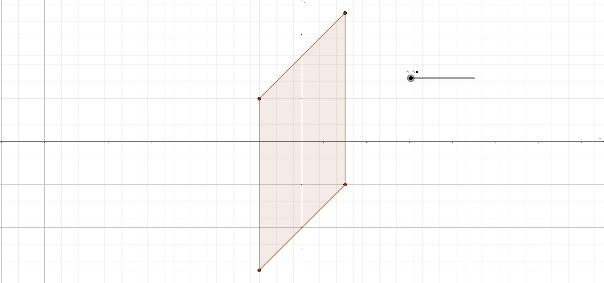

# SVGtoPlot

#### Make paths-only-SVG to a parametric function with Fourier Transformation.

Development will be very slow 🤔🤔

### Plan to implement SVGtoPlot

1.  For given path, give range of parameter `t` from `k/n` to `(k+1)/n` (or divide range by their lengths).
2.  Make parametric equation for each path.
3.  Separate x-function and y-function.
4.  For each component, combine and execute FT with given accuracy and the number of terms of the result of FT.

### Description of commands in `<path d="">`

-   M
    -   Usage: `M x y` or `m dx dy`
    -   Action: **Move** the starting point to given position
-   L
    -   Usage: `L x y` or `l dx dy`
    -   Action: Draws a **line** from the last point to given position.
-   H
    -   Usage: `H x` or `h dx`
    -   Action: Draws a **horizontal line** from the last point to the point with given x-coordinate.
-   V
    -   Usage: `V y` or `v dy`
    -   Action: Draws a **vertical line** from the last point to the point with given y-coordinate.
-   Z
    -   Usage: `Z` or `z`
    -   Action: **Closes** the path. It means this draws a line from the last point to the starting point.
-   C
    -   Usage: `C x1 y1, x2 y2, x y` or `c dx1 dy1, dx2 dy2, dx dy`
    -   Action: Draws a **cubic Bezier curve** from the last point to the given point(`x y`), with given two control points(`x1 y1, x2 y2`).
-   S
    -   Usage: `S x2 y2, x y` or `s dx2 dy2, dx dy`
    -   Action: Draws a **continued cubic Bezier curve** from the last point to the given point(`x y`), with one control point used before and new given control point(`x2 y2`).
-   Q
    -   Usage: `Q x1 y1, x y` or `q dx1 dy1, dx dy`
    -   Action: Draws a **quadratic Bezier curve** from the last point to the given point(`x y`), with given control point(`x1 y1`).
-   T
    -   Usage: `T x y` or `t dx dy`
    -   Action: Draws a **continued quadratic Bezier curve** from the last point to the given point, with the control point used before.
-   A

    -   Usage: `A rx ry x-rotate-angle large-arc-flag sweep-flag x y` or `a rx ry x-rotate-angle large-arc-flag sweep-flag dx dy`
    -   Action: Draws a **arc** on an oval with given radius, angle, and flag from the last point to the given point(`x y`).

### Building equations of commands

-   M

    -   Since M is called only at the first time, we can assume that starting point of graph is set to given position.

        

-   L

    -   Using fact that line segment from (u,v) to (x,y) can be written as

        

-   H

    -   Using the equation of L, equation for H and V is easily derivable.

        

-   V

    -   Same with H.

        

-   Z

    -   It is exactly same with L, except destination point is set to the first point of path.

        

-   Q

    -   For quadratic bezier curve, points on the curve is written as 
    
        where U is the last point, X1 is a given control point, and X is the destination point.

        

-   T

    -   Since continued, X1 in Q is already set as U1, the last control point.

        

-   C

    -   For cubic bezier curve, points on the curve is written as 
    
        where U is the last point, X1 and X2 are given control points, and X is the destination point.

        

-   S

    -   Since continued, X1 in C is already set as U1, the last control point.

        

-   A

    -   Equation deriving

        For given radii a and b, equation for ellipse can be written as
        
        
        
        or in parametric form
        
        
        
        However, ellipse can be rotated by angle given in command. So rotation of axis is needed to manipulate equation.
        
        SVG path uses clockwise rotation unlike usual mathematics, so negative value should be used. For given rotation angle χ, let φ ≡ (-χ) mod 180. Then φ will be used since ellipse with rotation angle χ has same phase with one with angle -φ. In addition, φ will have range \[0, π).
        
        By rotation, new axis x' and y' is set to
        
        
        
        where
        
        
        
        and new equation will be
        
        
        
        and
        
        
        
        in parametric form.
        
        Using the last point U as (u, v), given destination point X as (s, t), and equation above, new system is built as
        
        
        
        The variables to solve are m, n, α, and β. There will be two solutions for this system.
        
        By subtracting equation 1 and 3, following equation is derived.
        
        
        
        Using same method with equation 2 and 4,
        
        
        
        By multiplying cosφ, sinφ to each equation and adding/subtracting well, two equations can be derived as following.
        
        
        
        Using trigonometric conversion equation, two equations above can be derived into
        
        
        
        where
        
        
        
        By dividing one of those equation by another one, a simple equation
        
        
        
        is derived. Therefore
        
        
        
        and
        
        
        
        Since
        
        
        
        
        
        and
        
        
        
        Using cosα and sinα, m and n can be written with a, b, y, v, s, and t like following.
        
        
        
        
        
        where
        
        
        
        So the equation will be
        
        
        
        However, there are sweep-flag and large-arc-flag, and these flags are needed to determine the only solution for arc. First, large-arc-flag will be used for constraint of (β-α) value. Next, the value (sweep-flag ^ large-arc-flag) will be used for determining the only center of ellipse.
        
        To determine α and β, we have to define the range of both variables first.
        
        **Step 1**.
          First, let's set the range limit of α to [-π, π]. Then range of β will be set to [α-π, α+π] to cover all possibilities, and parallelogram will be drawn when range of α and β is shown on α-β plane.
          
        **Step 2**. However, values over 2π or under -2π are difficult to deal with. ranges out of black square should be cut and move into the square.
        
        **Step 3**. Two red triangles are selected to be relocated.
        
        **Step 4**. New areas for red triangles are selected to green triangles. For example in upper red triangle, the point (π, 2π) is exactly same situation with the one of point (-π, 0). Points like (π, π) or (0, 2π) are also equivalent to (-π, -π) and (-2π, 0). Therefore, the fact that two points on y=x+C (C is arbitrary constant) are equivalent when difference of x-value (or y-value) is multiple of 2π.
        
        **Step 5**. Using fact above, two red triangles will be moved to green areas.
        
        **Step 6**. Then shape of the range becomes a diamond shape and fit into the black square.
